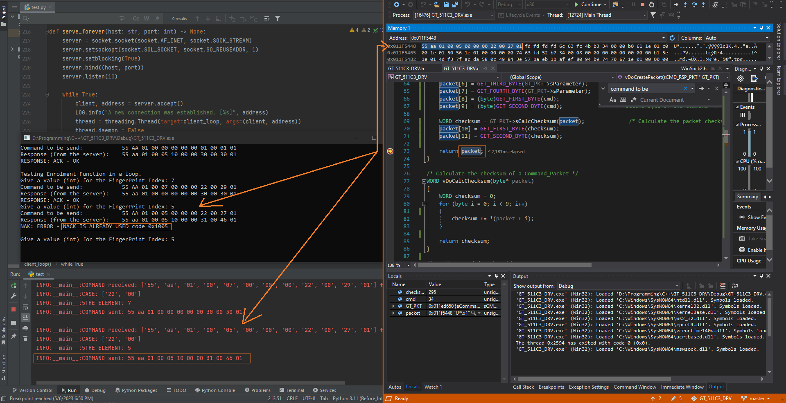

<h1 style="font-size: 32px;"><strong>GT-511C3 Fingerprint Sensor Driver / Python Server Exercise:</strong></h1>

This project is intended as an exercise in developing programming skills and is not a complete driver for the GT-511C3 hardware - but can be easily addapted.

The driver (written in C, based on the GT-511C3 datasheet) is designed to be run as a client to a Python server that simulates the behavior(responses) of the fingerprint sensor.

<h3>Key features of the implementation:</h3>

- data types: structs, enums, typedef
- preprocessor directives with macros to improve code organization and readability.
- standard streams, stderr and stdout, for error and debug messages respectively.
- use of bitwise operations to manipulate data at the bit level in order to optimize code's performance.
- implementation of OOP concepts such as encapsulation and abstraction (even though the project is written in C).
- use of the Singleton design pattern to ensure a single instance of the FingerPrint data is created throughout the application.
- a brief touch of networking, specifically Windows sockets, to communicate with the Python server and simulate the behavior of the fingerprint sensor.

<h3>Example of one of the comamnds (LITTLE ENDIAN USED!):</h3>

Command - ""Enrollment Start"" (FingerPrint Index = 23 (17 HEX)):

(Microcontroller command) - SEND: "55 AA 01 00 17 00 00 00 22 00 39 01"

(FingerP Sensor response) - RECV: "55 AA 01 00 00 00 00 00 30 00 30 01"

Command Start code1 = 0x55

Command Start code2 = 0xAA

Device ID = 0x00 01

Input parameter = 0x00 00 00 17

Command Code = 0x00 22

CheckSum = 0x01 39

ACK: 0x00 30

I recommand using the Visual Studio Debug Tab -> Windows -> Memory -> in order to see how the packets / commands are created.

Datasheet for more details: https://cdn.sparkfun.com/datasheets/Sensors/Biometric/GT-511C1R_datasheet_V2-2016-10-25.pdf

Snippit Example:

